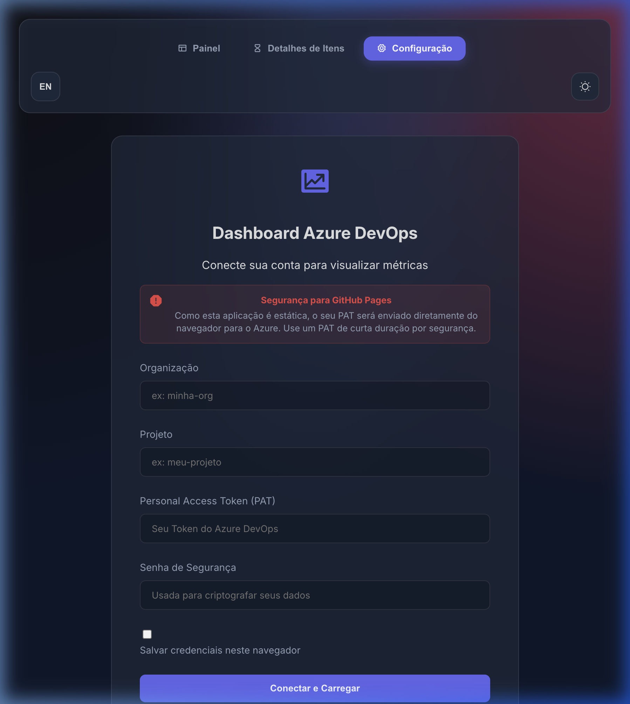
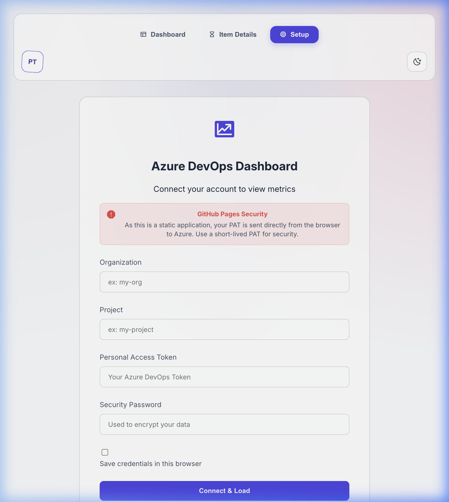

# 📊 Azure DevOps Analytics Dashboard

A premium, high-performance visualization tool for Azure DevOps, designed for clarity, security, and deep project insights. Built as a static application, it is perfectly suited for hosting on **GitHub Pages** and embedding in Google Sites.

## 🚀 Key Features

- **Dynamic Gantt Chart**: interactive timeline for Epics, Features, and Stories.
- **Activity Heatmap**: Visualize work frequency and team velocity over time.
- **Performance Analytics**: Real-time Lead Time and Cycle Time charts for process optimization.
- **Deep Backlog Analysis**: Detailed item view with "Aging" tracking and status hierarchy mapping.
- **Multi-language Support**: Full Internationalization (i18n) for English and Portuguese (PT-BR).
- **Responsive Design**: Optimized for everything from large monitors to mobile viewports.

## 🖼️ Interface Preview

### 🖥️ Setup & Connection
The initial screen provides a secure environment to connect your Azure DevOps account. You can choose your preferred language and theme right from the start.

*Modern and secure setup interface in Dark Mode.*

*Clean and professional setup interface in Light Mode (English).*

> [!TIP]
> Use the theme toggle in the top-right corner to switch between Dark and Light modes. The language toggle is located in the top-left.

## 🔒 Security First (Static Hosting Optimization)

This dashboard uses a unique **client-side security model** designed for static environments like GitHub Pages:

1.  **AES-GCM Encryption**: Your Personal Access Token (PAT) is encrypted with 256-bit AES-GCM using the browser's Web Crypto API.
2.  **User-Provided Password**: Encryption keys are derived from a password *you* provide. No plain-text tokens are ever stored.
3.  **Encrypted Persistence**: Choose to save your credentials in `localStorage` (secured by your password) or keep them in-memory for the session.
4.  **Zero-Backend**: All processing happens in your browser. Your data never touches a third-party server.

## 🛠️ Setup Instructions

To use this dashboard, you need a Personal Access Token (PAT) from Azure DevOps.

### 1. Generating your PAT
1.  Log in to [Azure DevOps](https://dev.azure.com/).
2.  Go to **User Settings** (top right) > **Personal Access Tokens**.
3.  Click **+ New Token** and name it "Analytics Dashboard".
4.  Set **Scopes** to `Custom defined` and grant **Work Items: Read**.
5.  **Copy the token**: You will need it for the initial setup.

### 2. Connection Details
- **Organization**: Found in your URL (`dev.azure.com/{organization}`).
- **Project**: Found in your URL after the organization name.

## 💻 Tech Stack

- **Core**: Vanilla JavaScript (ES6+), HTML5, CSS3.
- **Build**: Vite (Fast HMR & Optimized Production Bundles).
- **Icons**: Phosphor Icons.
- **Charts**: Custom SVG/Canvas implementation for maximum performance.
- **Security**: Web Crypto API (SubtleCrypto).

## 📄 License

This project is licensed under the **MIT License**. See the `LICENSE` file for details.
